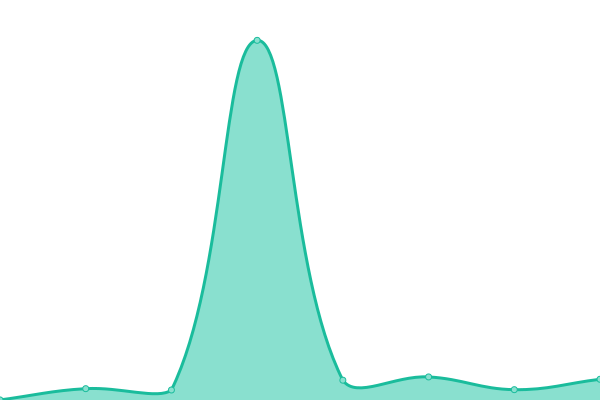

# [📈 Estado en vivo](https://demo.upptime.js.org): <!--live status--> **✅ Todos los sistemas operativos**

This repository contains the open-source uptime monitor and status page for [Upptime](https://upptime.js.org), powered by [Upptime](https://github.com/upptime/upptime).

With [Upptime](https://upptime.js.org), you can get your own unlimited and free uptime monitor and status page, powered entirely by a GitHub repository. We use [Issues](https://github.com/upptime/upptime/issues) as incident reports, [Actions](https://github.com/terorero/radar/actions) as uptime monitors, and [Pages](https://demo.upptime.js.org) for the status page.

<!--start: status pages-->
<!-- This summary is generated by Upptime (https://github.com/upptime/upptime) -->
<!-- Do not edit this manually, your changes will be overwritten -->
<!-- prettier-ignore -->
| URL | Status | History | Response Time | Uptime |
| --- | ------ | ------- | ------------- | ------ |
|  [CloudPanel-Soporte](https://cpanel.soporte.eu.org) | 🟩 Up | [cloud-panel-soporte.yml](https://github.com/cloud-bitacora/radar/commits/HEAD/history/cloud-panel-soporte.yml) | 

 1258ms
     
 | 

<a href="https://radar.root24.eu.org/history/cloud-panel-soporte">100.00%</a>
    

|  [Fpanel-IGMC](https://larazon.igmc.news) | 🟩 Up | [fpanel-igmc.yml](https://github.com/cloud-bitacora/radar/commits/HEAD/history/fpanel-igmc.yml) | 

 502ms
     
 | 

<a href="https://radar.root24.eu.org/history/fpanel-igmc">93.79%</a>
    

|  [Menu-24](https://menu.root24.eu.org) | 🟩 Up | [menu-24.yml](https://github.com/cloud-bitacora/radar/commits/HEAD/history/menu-24.yml) | 

 260ms
     
 | 

<a href="https://radar.root24.eu.org/history/menu-24">27.47%</a>
    

|  [Bitácora d ROOT](https://www.bitacoraroot.com) | 🟩 Up | [bitacora-d-root.yml](https://github.com/cloud-bitacora/radar/commits/HEAD/history/bitacora-d-root.yml) | 

 144ms
     
 | 

<a href="https://radar.root24.eu.org/history/bitacora-d-root">100.00%</a>
    

|  [Fpanel LR-Sisetic](https://larazon.sisetic.com) | 🟩 Up | [fpanel-lr-sisetic.yml](https://github.com/cloud-bitacora/radar/commits/HEAD/history/fpanel-lr-sisetic.yml) | 

 335ms
     
 | 

<a href="https://radar.root24.eu.org/history/fpanel-lr-sisetic">100.00%</a>
    

|  [Airdrop-24](https://airdrop.root24.eu.org) | 🟩 Up | [airdrop-24.yml](https://github.com/cloud-bitacora/radar/commits/HEAD/history/airdrop-24.yml) | 

 265ms
     
 | 

<a href="https://radar.root24.eu.org/history/airdrop-24">100.00%</a>
    

|  [Drive-24](https://drive.root24.eu.org/login/) | 🟩 Up | [drive-24.yml](https://github.com/cloud-bitacora/radar/commits/HEAD/history/drive-24.yml) | 

 1068ms
     
 | 

<a href="https://radar.root24.eu.org/history/drive-24">100.00%</a>
    

|  [CONDEVIN Web](https://www.devinconde.com) | 🟩 Up | [condevin-web.yml](https://github.com/cloud-bitacora/radar/commits/HEAD/history/condevin-web.yml) | 

 345ms
     
 | 

<a href="https://radar.root24.eu.org/history/condevin-web">100.00%</a>
    

<!--end: status pages-->

[**Visit our status website →**](https://radar.root24.eu.org)

## 📄 License

- Powered by: [Upptime](https://github.com/upptime/upptime)
- Code: [MIT](./LICENSE) © [Upptime](https://upptime.js.org)
- Data in the `./history` directory: [Open Database License](https://opendatacommons.org/licenses/odbl/1-0/)
